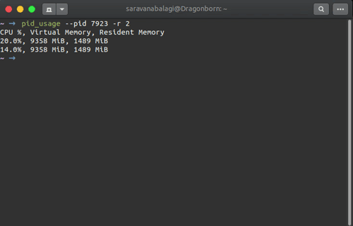

## PID Usage

A tiny command line utility to get current CPU Utilization, RAM Usage and Virtual Memory Usage of a process 
(including all its subprocesses) in CSV Format. It's particularly more useful if you're looking to save as a 
CSV file for making graphs.

```sh
pid_usage --pid=5432                                                                                                                                                                                                                         master ✭  
CPU %, Virtual Memory, Resident Memory
10.0%, 4601 MiB, 154 MiB
```



## Options

You can customlize the following options:

```
  -i, --interval=I           (float) Calculate usage every I seconds
      --no-header            Don't print the header row
  -p, --pid=PID              (int) PID of program to monitor
  -r, --repeat=R             (int) Program prints output R times
  -?, --help                 Give this help list
      --usage                Give a short usage message
  -V, --version              Print program version

```

## Installation

Installation instructions for current user, all users, and for temporary execution 
can be found in [INSTALL.md](INSTALL.md) 

## What's wrong with `ps` and `top`?

Firstly, `cpu%` values from `ps` and `top` are not [similar](https://unix.stackexchange.com/q/58539/278762). 
`ps` gives total cpu usage as the percentage of time spent running during the entire lifetime of a process.
This value is not current cpu utilization value. `top` gives correct current CPU utilization for a given process. 

Secondly, CPU Utilization and memory values of a process in both `ps` and `top` do not include that of it's subprocesses.

For total cpu utilization, during the first time, `top` gives cpu usage since boot. 
After that, it gives cpu usage since the last queried time.
This means when you use `top` and parse the cpu percent using `awk` 
in your shell script inside a for loop, the values you get won't be the current cpu utilization!

## Contribution

Pull requests are very welcome.

1. Fork the repo
1. Create new branch with feature name as branch name
1. Check if things work with a jupyter notebook
1. Raise a pull request

## Licence

See attached [Licence](LICENSE)